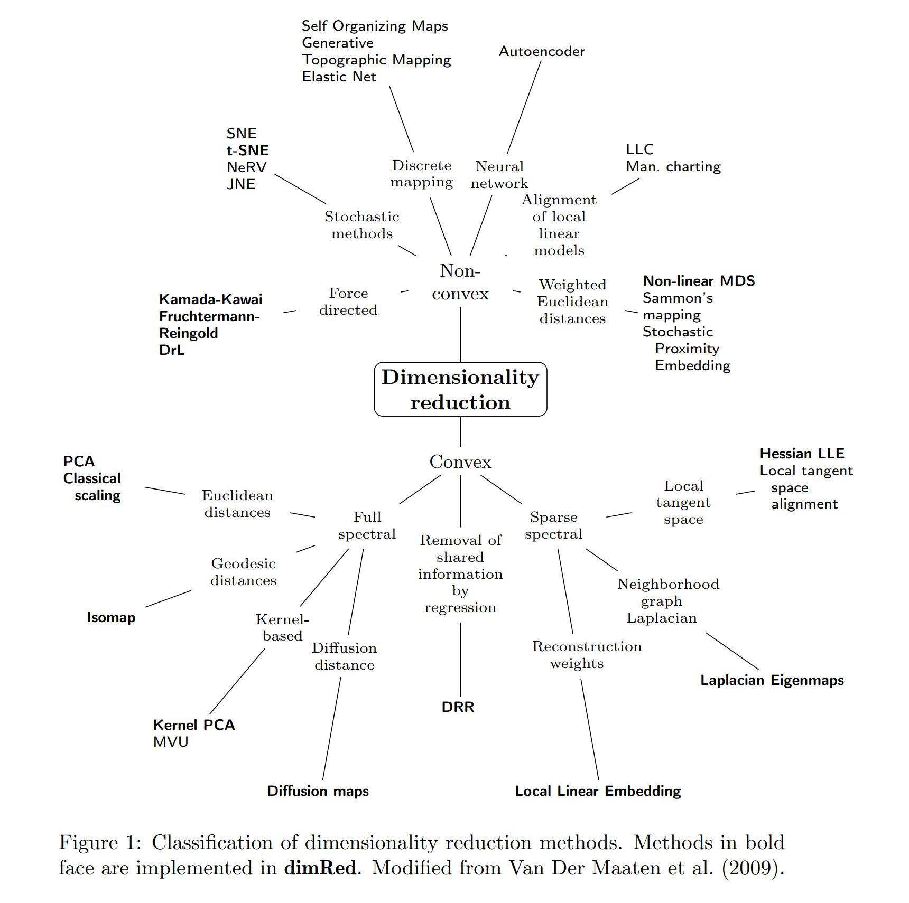

# Description of Problem

- *Background*: A large multinational corporation is seeking to automatically identify the sentiment
that their customer base talks about on social media. They would like to expand this
capability into multiple languages. Many 3rd party tools exist for sentiment analysis,
however, they need help with under-resourced languages.

- *Goal*:  Train a sentiment classifier (Positive, Negative, Neutral) on a corpus of the provided
documents. Your goal is to maximize accuracy. There is special interest in being able
to accurately detect negative sentiment. The training data includes documents from
a wide variety of sources, not merely social media, and some of it may be
inconsistently labeled. Please describe the business outcomes in your work sample
including how data limitations impact your results and how these limitations could
be addressed in a larger project.

- *Data*:  Link to data: http://archive.ics.uci.edu/ml/datasets/Roman+Urdu+Data+Set

## Outline of the solution:

1. Analyze data, data quality, cleanse data
1. Will go for a "bag of words" (orderless) approach. Create document term matrix (rows are the documents, columns are non-sparse terms)
1. Filter out "neutrals", only keep "negative" and "positive" documents
1. Train multiple classifier models (H2O automl) with double weights on the negative training examples, use "misclassification" as the functional to optimize. Positive+Neutral are lumped
1. Produce a leaderboard, report metrics, e.g., our 5-CV AUC was ~75%, and confusion matrix shows error rate for negatives of only 13%.
1. Suggestions for improvements to the appearin the end

# Analyze input file

Load packages

```{r,message=F}
library(tidyverse)
library(data.table)
library(tm)
library(xgboost)
library(h2o)
```

```{r}
h2o.init()
# h2o.shutdown()
```

Source file

```{r}
fname <- "data/Roman Urdu DataSet.csv"
```

Encoding is UTF-8

```{r}
guess_encoding(fname)
```

Look at the first few lines of file:

- comma separated, header is missing

```{r}
read_lines(fname,n_max = 3)
```

Reads 3-col csv as characters

```{r}
df_urdu <- read_csv("data/Roman Urdu DataSet.csv",col_names = c("phrase","sentiment","bogus"),
                    col_types = "ccc", # all are chars
                    #n_max=3
                    )
df_urdu %>% glimpse
```

Third column can truly be ignored

```{r}
df_urdu %>% count(bogus,sort=T)
```

Categories on sentiment column:

```{r}
df_urdu %>%
  ggplot(aes(sentiment,fill=sentiment)) +
  geom_bar()
```

One sacred line with "Neative", what is it?

```{r}
df_urdu %>% filter(sentiment == "Neative")
```
A few lines have NA phrases, which need to be removed.

```{r}
df_urdu %>%
  filter(is.na(phrase))
```
## Study characters in the set

```{r}
df_urdu$phrase[1] %>% str_split("")
```

Frequency count of all chars used

```{r}
count_chars <- function(df,col) {
  df %>%  # head(10) %>%
  mutate(chars = {{col}} %>% str_split("")) %>%
  select(chars) %>%
  unnest(chars) %>%
  count(chars,sort=T) %>%
  mutate(prop=sprintf("%.3f",n/sum(n)))  
}
```

```{r}
df_char_freq <- df_urdu %>% count_chars(phrase)
df_char_freq%>%glimpse
```

Which are non-alpha. Note 0x001F602 doesn't exist.

```{r}
df_char_freq %>% filter(!str_detect(chars,"[:alpha:]"))
```
Preprocessing steps:

- eliminate NA phrases
- change 'Neative' to 'Negative'
- eliminate non-alpha (includes numbers)
- convert all to lower-case
- squish multiple spaces

```{r}
df_urdu_clean <- df_urdu %>%
  filter(!is.na(phrase)) %>%
  mutate(sentiment=if_else(sentiment=="Neative","Negative",sentiment)) %>%
  mutate(phrase_clean=phrase %>%
           str_remove_all("[^ [:alpha:]]") %>%
           str_to_lower() %>%
           str_squish()) %>%
  select(phrase_clean,sentiment)
df_urdu_clean %>% head(10)
```
Confirm chars are ok

```{r}
df_urdu_clean %>% count_chars(phrase_clean)
```
# Token-oriented study

```{r}
df_urdu_tokens <- df_urdu_clean %>%
  mutate(token = str_split(phrase_clean,fixed(" "))) %>%
  select(token) %>%
  unnest(token) %>%
  count(token,sort=T) %>%
  mutate(id=row_number(),
         prop=n/sum(n),
         propSum=cumsum(prop))
df_urdu_tokens
```

## Build Document Term Matrix

Create term matrix. Each rows has the count of the top N tokens

```{r}
corpus_urdu <- SimpleCorpus(VectorSource(df_urdu_clean$phrase_clean))
```

Creat a document term matrix

```{r}
fn_tf_idf <- function(x) weightTfIdf(x, normalize = F)

dtm_urdu <- DocumentTermMatrix(corpus_urdu
                               , control = list(weighting = fn_tf_idf)
                               )
dtm_urdu
```

Inspect first five lines and first 10 columns

```{r}
mtx <- inspect(dtm_urdu[1:10,1:100]) %>% as.matrix
mtx %>% dim
```

## Assemble training framre

Note: 99.8% sparsity => 673 columns, AUC ~ 75%
995 => ~200 columns, AUC falls to 70%

```{r}
df_urdu_dtm <- removeSparseTerms(dtm_urdu, 0.998) %>%
  as.matrix %>%  as_tibble %>%
  bind_cols(df_urdu_clean %>% select(sentiment) %>%
              mutate_at(vars(sentiment),as.factor)) %>%
  select(sentiment,everything())
df_urdu_dtm %>% dim
```

```{r,eval=F}
df_urdu_dtm %>% write_rds("data/df_urdu_dtm.rds",compress = "bz2")
```

# Compressibility Analysis

## Scree plot of PCA

```{r,eval=F}
urdu_dtm_pca <- h2o.prcomp(df_urdu_dtm %>% as.h2o,
                        k = 50,
                        impute_missing = T
                        #,use_all_factor_levels = TRUE
                        #,pca_method = "GLRM"
                        #,transform = "STANDARDIZE"
                        )

df_urdu_pca <- urdu_dtm_pca@model$model_summary %>%
  as.data.frame %>%
  as.matrix %>%
  t() %>%
  as_tibble(rownames = "component") %>%
  mutate(n=row_number(),.before=1)
df_urdu_pca %>% write_csv("data/df_urdu_pca.csv")
```

```{r,include=F}
df_urdu_pca <- read_csv("data/df_urdu_pca.csv")
```

Bad PCA compression!

```{r}
df_urdu_pca %>%
  ggplot(aes(n,`Cumulative Proportion`)) +
  geom_line() +
  geom_point() +
  labs(title="PCA: Cumulative explained variance")
```

## t-SNE low dim viz

```{r, child='02_rtsne.Rmd'}
```

# (Failed Attempt 1): Linear separability

Create train (80%) and test sets.

```{r}
set.seed(0)
permutations <- sample.int(nrow(df_urdu_dtm),nrow(df_urdu_dtm))
train_pct <- 0.8
train_max <- as.integer(length(permutations)*train_pct)
df_urdu_dtm_train <- df_urdu_dtm[permutations[1:train_max],]
df_urdu_dtm_test <- df_urdu_dtm[permutations[(train_max+1):length(permutations)],]
```

Get prob matrix of top 100 words, only using 80% of the dataset

```{r}
df_urdu_word_probs <- df_urdu_dtm_train %>%
  pivot_longer(-sentiment) %>%
  group_by(sentiment,name) %>%
  summarize(value=sum(value)) %>%
  group_by(sentiment) %>%
  # slice_max(n=1000, order_by=value) %>%
  ungroup() %>%
  pivot_wider(names_from="sentiment") %>%
  rowwise() %>%
  mutate(total=sum(c_across(Negative:Positive))) %>%
  ungroup() %>%
  mutate_at(vars(Negative:Positive),~./sum(.))
df_urdu_word_probs
```
Create efficient lookup table

```{r}
dt_urdu_word_probs <- df_urdu_word_probs %>% as.data.table()
setkey(dt_urdu_word_probs,"name")
```

Evaluate performance (create confusion matrix)

```{r}
categorize_phrase <- function(df_phrase) {
  dt_pivot <- df_phrase %>%
    pivot_longer(-sentiment,names_to="name") %>%
    as.data.table()
    
  df_sums <- merge(dt_pivot,dt_urdu_word_probs,by="name") %>%
    # inner_join(df_urdu_word_probs) %>%
    mutate_at(vars(Negative:Positive),~.*log(1+value)) %>%
    summarize_at(vars(Negative:Positive),sum,na.rm=T)
    pred <- with(df_sums,
                 { sum_max <- which.max(c(Negative,Neutral,Positive))
                 c("Negative","Neutral","Positive")[sum_max] })
    pred
}

df_urdu_dtm_test %>% head(1) %>% categorize_phrase()
```

Slow: predict on test set

```{r,eval=F}
df_urdu_dtm_test_confusion_mtx <- df_urdu_dtm_test %>%
  # head(200) %>%
  mutate(pred=pmap_chr(., ~categorize_phrase(as_tibble_row(list(...))))) %>%
  select(sentiment,pred) %>%
  count(sentiment,pred) %>%
  pivot_wider(names_from = "pred",values_from="n")
df_urdu_dtm_test_confusion_mtx %>% write_csv("data/simple_confusion_mtx_norm_col_tf_idf.csv")
```

## Confusion Matrix: normalize cols

```{r}
read_csv("data/simple_confusion_mtx_norm_col.csv") %>%
  rowwise() %>%
  mutate(total=c_across(Negative:Positive)%>%sum) %>%
  mutate_at(vars(Negative:Positive),~./total)
```

## Confusion Matrix: normalize cols with tf*idf

```{r}
read_csv("data/simple_confusion_mtx_norm_col_tf_idf.csv") %>%
  rowwise() %>%
  mutate(total=c_across(Negative:Positive)%>%sum) %>%
  mutate_at(vars(Negative:Positive),~./total)
```

# (Successful) Attempt 2: Machine Learning

Bring sentiment column: allocate twice the weight to Negative which becomes the "TRUE"

```{r,eval=F}
df_urdu_dtm_y <- df_urdu_dtm %>%
  # double the weight on negatives
  mutate(weight=if_else(sentiment=="Negative",2,1)) %>%
  select(sentiment,weight,everything()) %>%
  # filter(sentiment!="Neutral") %>%
  mutate(sentiment=sentiment=="Negative")
```


Slow: do any of the columns have NA

```{r,eval=F}
any_na <- function(vals) any(is.na(vals))

df_urdu_mtx %>% as_tibble %>%
  mutate(has_na=pmap_lgl(.,~any_na(list(...)))) %>%
  filter(has_na)
```

Cast to h2o data frame

```{r,eval=F}
df_urdu_h2o <- df_urdu_dtm_y %>%
  as.h2o()
df_urdu_h2o
```

AutoML main call (trains a bunch models, with 5-fold CV), 720s

```{r,eval=F}
ml_urdu <- h2o::h2o.automl(y="sentiment",
                           weights_column = "weight",
                           training_frame=df_urdu_h2o,
                           max_runtime_secs = 720,
                           seed=0,
                           stopping_metric = "misclassification")
```

Write leaderboard to file

```{r,eval=F}
ml_urdu@leaderboard %>% as_tibble %>% write_csv("leaderboard.csv")
```

Recover leaderboard

```{r}
df_leaderboard <- read_csv("leaderboard.csv")
```

Show leader board, getting ~74% AUC

```{r}
df_leaderboard %>%
  mutate(model_id=str_sub(model_id,end=20)) # %>%
  #knitr::kable() %>%
  #kableExtra::kable_styling(bootstrap_options = c("striped", "hover", "condensed")
#)
```
Save names of models and models to file (to be able to retrieve order)

```{r,eval=F}
ml_urdu@leaderboard$model_id %>%
  as_tibble %>%
  write_csv("saved_models.csv")

ml_urdu@leaderboard$model_id %>%
  as.data.frame %>% pull(model_id) %>%
  head(6) %>%
  walk(~h2o.saveModel(h2o.getModel(.x),path="models",force=T))
```

Read saved models list

```{r}
df_saved_models <- read_csv("saved_models.csv")
```

Retrieve saved models as h2o model objects

```{r}
list_loaded_models <- df_saved_models$model_id %>%
  head(6) %>%
  map(~h2o.loadModel(str_c("models/",.x)))
```

Report confusion matrix of the top model (~13% error rate for "Negative"=TRUE)

```{r}
h2o.confusionMatrix(list_loaded_models[[1]])
```

Plot AUC curve for 1st non-stacked model

```{r}
model_non_stacked <- list_loaded_models%>%discard(~str_starts(.x@model_id,"Stacked"))%>%first
model_non_stacked@model_id
```

Plot AUC of top non-stacked model

```{r}
plot(model_non_stacked%>%h2o.performance(xval=T),type="roc")
```

Plot variable importance for the first non-stacked model

```{r}
h2o.varimp_plot(model_non_stacked)
```

```{r}
h2o::h2o.shutdown()
```


# Business outcomes and Next Steps

## Business value

Assess individual or group sentiment of tweets, chats, etc. so as to:
- Plan, train, alert customer care representatives
- Fine-tune marketing messages which optimize sentiment
- Quickly identify disgruntled employees, users, customers, bad brand interaction, etc.

## Suggested next steps

- Dataset
  - The sample is small (20k snippets), though the quality is generally good
  
- Potential fine-tunings to current approach
  - Play with sparsity threshold to include more or less words into vocabulary.
  - Use non-linear of dimensionality reduction, e.g. t-SNE, see picture below,
  - Test Union(Neutral,Positive) vs Negative
  - Use XGBoost, needs h2o on Linux or Mac
  - Could have separate classifier for "Neutral"
- Tried but ineffective
  - 3-class positive, negative, neutral (non-lumped)
  - PCA (no effective compression)
  - Play with TF*IDF on document term matrix (initial tests were not good)

- Other approaches
  - Translate Urdu words into English and augment with English positive/negative sentiment word tables.
  - Augment the "bag of words" approach with order-depedency (use non-sparse 2- and 3-word sequences as features).
  - Use some order dependency to corroborate sentiment, LSTM or HMMs come to mind 
  - Build correlation matrices of each of the non-sparse unique words and the positive/negative/neutral labels. Do a naive-bayes and/or perceptron classifier. Blend its predictions w/ the best ML one

## Types of dimensionality reduction

[source](https://cran.r-project.org/web/packages/dimRed/vignettes/dimensionality-reduction.pdf)

```{r,echo=F}

```

